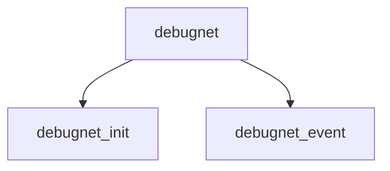

# Component: debugnet.c

**Path:** `sys/net/debugnet.c`
**Type:** File
**Maps to:** `.discovery/sys/net/debugnet.md`

## Purpose

Debugnet - network debugging infrastructure.

## Structure

## Key Functions

| Function | Purpose | Signature |
|----------|---------|-----------|
| `debugnet_init` | Init | `void debugnet_init(void)` |
| `debugnet_event` | Event | `void debugnet_event(struct ifnet *ifp, int event)` |

## Use Cases

| Use | Description |
|-----|-------------|
| `debug` | Network debugging |
| `trace` | Packet tracing |

## Includes

- `net/debugnet.h` - Debugnet definitions