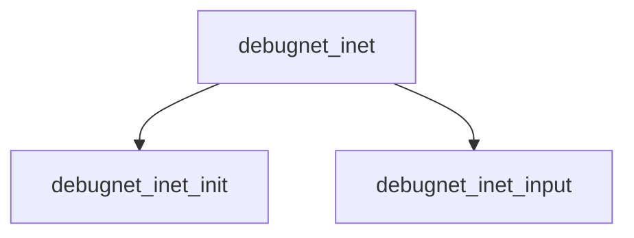

# Component: debugnet_inet.c

**Path:** `sys/net/debugnet_inet.c`
**Type:** File
**Maps to:** `.discovery/sys/net/debugnet_inet.md`

## Purpose

Debugnet inet - network debugging for inet protocols.

## Structure

## Key Functions

| Function | Purpose | Signature |
|----------|---------|-----------|
| `debugnet_inet_init` | Init | `void debugnet_inet_init(void)` |
| `debugnet_inet_input` | Input | `void debugnet_inet_input(struct ifnet *ifp, struct mbuf *m)` |

## Use Cases

| Use | Description |
|-----|-------------|
| `debug` | Network debugging |
| `inet` | IPv4 debug |

## Includes

- `net/debugnet.h` - Debugnet definitions