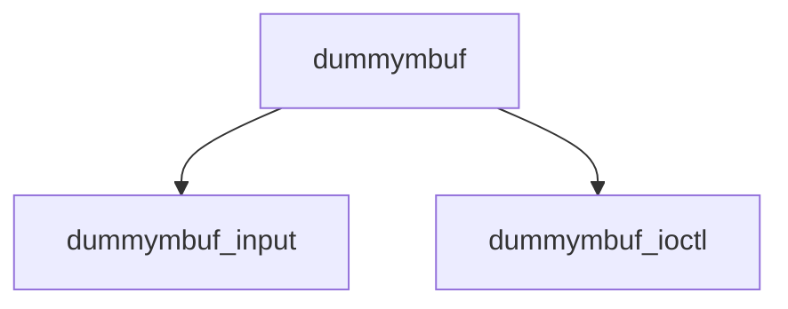

# Component: dummymbuf.c

**Path:** `sys/net/dummymbuf.c`
**Type:** File
**Maps to:** `.discovery/sys/net/dummymbuf.md`

## Purpose

Dummy mbuf - testing module that drops or modifies packets.

## Structure

## Key Functions

| Function | Purpose | Signature |
|----------|---------|-----------|
| `dummymbuf_input` | Input | `void dummymbuf_input(struct mbuf *m, struct ifnet *ifp)` |
| `dummymbuf_ioctl` | Ioctl | `int dummymbuf_ioctl(struct ifnet *ifp, u_long cmd, caddr_t data)` |

## Use Cases

| Use | Description |
|-----|-------------|
| `testing` | Packet testing |
| `dummy` | Dummy interface |

## Includes

- `net/if.h` - Interface definitions