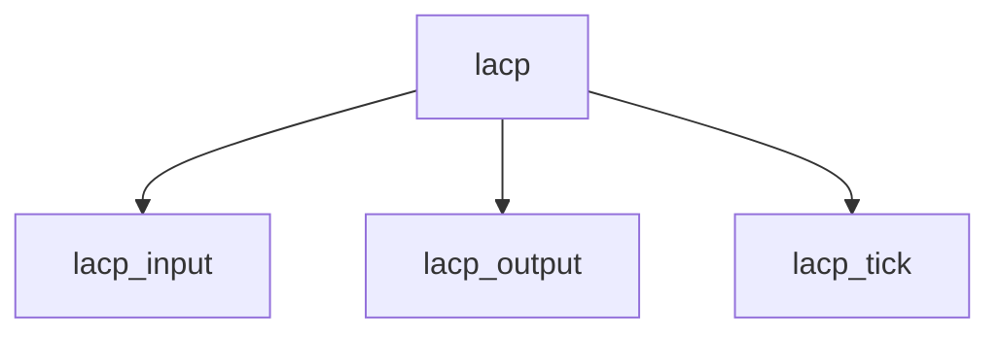

# Component: ieee8023ad_lacp.c

**Path:** `sys/net/ieee8023ad_lacp.c`
**Type:** File
**Maps to:** `.discovery/sys/net/ieee8023ad_lacp.md`

## Purpose

LACP - Link Aggregation Control Protocol (IEEE 802.3ad).

## Structure

## Key Functions

| Function | Purpose | Signature |
|----------|---------|-----------|
| `lacp_input` | Input | `void lacp_input(struct ifnet *ifp, struct mbuf *m)` |
| `lacp_output` | Output | `void lacp_output(struct lagg_softc *sc, struct lagg_port *lp)` |
| `lacp_tick` | Tick | `void lacp_tick(struct lagg_softc *sc)` |

## LACP

| Item | Description |
|------|-------------|
| `LACP` | Link Aggregation |
| `Actor` | Actor partner |
| `Partner` | Partner info |

## Use Cases

| Use | Description |
|-----|-------------|
| `lacp` | Link aggregation |
| `802.3ad` | Standard |

## Includes

- `net/ieee8023ad_lacp.h` - LACP definitions