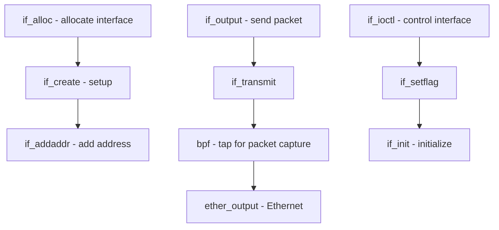

# Component: if.c

**Path:** `sys/net/if.c`
**Type:** File
**Maps to:** `.discovery/sys/net/if.md`

## Purpose

Network interface management - manages network interface cards (NICs), interface addresses, and interface-level operations. Core of the FreeBSD networking stack.

## Structure

## Key Functions

| Function | Purpose | Signature |
|----------|---------|-----------|
| `if_alloc` | Allocate interface | `struct ifnet *if_alloc(int type)` |
| `if_alloc_dev` | Allocate with device | `struct ifnet *if_alloc_dev(int type, device_t dev)` |
| `if_free` | Free interface | `void if_free(struct ifnet *ifp)` |
| `if_create` | Create interface | `struct ifnet *if_create(const char *name)` |
| `if_attach` | Attach to stack | `void if_attach(struct ifnet *ifp)` |
| `if_detach` | Detach from stack | `void if_detach(struct ifnet *ifp)` |
| `if_addaddr` | Add address | `int if_addaddr(struct ifnet *ifp, ...)` |
| `if_deladdr` | Delete address | `int if_deladdr(struct ifnet *ifp, ...)` |
| `if_output` | Output packet | `int if_output(struct ifnet *ifp, struct mbuf *m, ...)` |
| `if_input` | Input packet | `void if_input(struct ifnet *ifp, struct mbuf *m)` |
| `if_transmit` | Transmit packet | `void if_transmit(struct ifnet *ifp, struct mbuf *m)` |
| `if_setflag` | Set interface flags | `int if_setflag(struct ifnet *ifp, ...)` |
| `if_setlladdr` | Set link-layer addr | `void if_setlladdr(struct ifnet *ifp, ...)` |

## Interface Flags

| Flag | Value | Description |
|------|-------|-------------|
| `IFF_UP` | 0x1 | Interface is up |
| `IFF_RUNNING` | 0x40 | Interface is running |
| `IFF_BROADCAST` | 0x2 | Broadcast addr valid |
| `IFF_DEBUG` | 0x4 | Debugging |
| `IFF_LOOPBACK` | 0x8 | Loopback interface |
| `IFF_POINTOPOINT` | 0x10 | Point-to-point link |
| `IFF_MULTICAST` | 0x8000 | Supports multicast |
| `IFF_PPROMISC` | 0x10000 | Promiscuous mode |

## Interface Groups

| Group | Description |
|-------|-------------|
| `IFGROUP_ALL` | All interfaces |
| `IFGROUP_DEFAULT` | Default group |

## Includes

- `net/if.h` - Interface definitions
- `net/if_var.h` - Interface variables
- `net/if_clone.h` - Cloning interfaces

## Depends On

- `net/bpf.c` for packet capture
- `netinet/in.c` for IP addresses
- Device drivers attach via this API