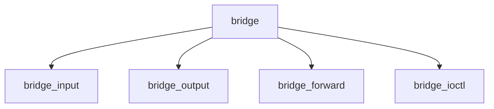

# Component: if_bridge.c

**Path:** `sys/net/if_bridge.c`
**Type:** File
**Maps to:** `.discovery/sys/net/if_bridge.md`

## Purpose

Ethernet bridge - network bridge for connecting Ethernet segments.

## Structure

## Key Functions

| Function | Purpose | Signature |
|----------|---------|-----------|
| `bridge_input` | Input | `void bridge_input(struct ifnet *ifp, struct mbuf *m)` |
| `bridge_output` | Output | `int bridge_output(struct ifnet *ifp, struct mbuf *m)` |
| `bridge_forward` | Forward | `void bridge_forward(struct bridge_softc *sc, struct mbuf *m)` |
| `bridge_ioctl` | Ioctl | `int bridge_ioctl(struct ifnet *ifp, u_long cmd, caddr_t data)` |

## Bridge Operations

| Op | Description |
|----|-------------|
| `BRDGADD` | Add interface |
| `BRDGDEL` | Delete interface |

## Use Cases

| Use | Description |
|-----|-------------|
| `bridge` | Ethernet bridge |
| `switch` | Layer 2 switch |

## Includes

- `net/bridge.h` - Bridge definitions