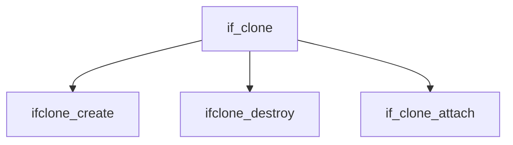

# Component: if_clone.c

**Path:** `sys/net/if_clone.c`
**Type:** File
**Maps to:** `.discovery/sys/net/if_clone.md`

## Purpose

Interface cloning - framework for cloning network interfaces.

## Structure

## Key Functions

| Function | Purpose | Signature |
|----------|---------|-----------|
| `ifclone_create` | Create | `int ifclone_create(const char *name, int loopback, struct ifclone **clp)` |
| `ifclone_destroy` | Destroy | `int ifclone_destroy(struct ifnet *ifp)` |
| `if_clone_attach` | Attach | `void if_clone_attach(struct ifclone *ifc)` |

## Use Cases

| Use | Description |
|-----|-------------|
| `clone` | Interface cloning |
| `clonable` | Clonable interfaces |

## Includes

- `net/if_clone.h` - Clone definitions