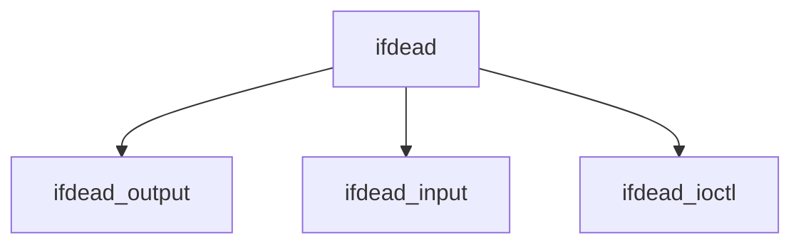

# Component: if_dead.c

**Path:** `sys/net/if_dead.c`
**Type:** File
**Maps to:** `.discovery/sys/net/if_dead.md`

## Purpose

Dead interface - placeholder for detached interfaces.

## Structure

## Key Functions

| Function | Purpose | Signature |
|----------|---------|-----------|
| `ifdead_output` | Output | `int ifdead_output(struct ifnet *ifp, struct mbuf *m, ...)` |
| `ifdead_input` | Input | `void ifdead_input(struct ifnet *ifp, struct mbuf *m)` |
| `ifdead_ioctl` | Ioctl | `int ifdead_ioctl(struct ifnet *ifp, u_long cmd, caddr_t data)` |

## Use Cases

| Use | Description |
|-----|-------------|
| `detached` | Detached interface |
| `placeholder` | Interface placeholder |

## Behavior

All operations return `ENXIO` or free the mbuf.