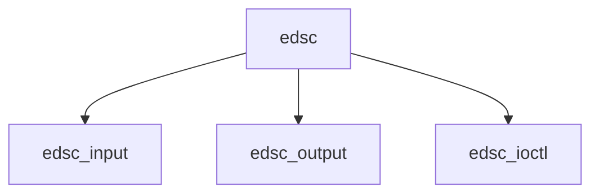

# Component: if_edsc.c

**Path:** `sys/net/if_edsc.c`
**Type:** File
**Maps to:** `.discovery/sys/net/if_edsc.md`

## Purpose

Discard interface - protocol testing interface that discards all packets.

## Structure

## Key Functions

| Function | Purpose | Signature |
|----------|---------|-----------|
| `edsc_input` | Input | `void edsc_input(struct ifnet *ifp, struct mbuf *m)` |
| `edsc_output` | Output | `int edsc_output(struct ifnet *ifp, struct mbuf *m)` |
| `edsc_ioctl` | Ioctl | `int edsc_ioctl(struct ifnet *ifp, u_long cmd, caddr_t data)` |

## Use Cases

| Use | Description |
|-----|-------------|
| `testing` | Protocol testing |
| `discard` | Discard packets |
| `edsc` | Ethernet Discard |

## Includes

- `net/if_clone.h` - Interface cloning