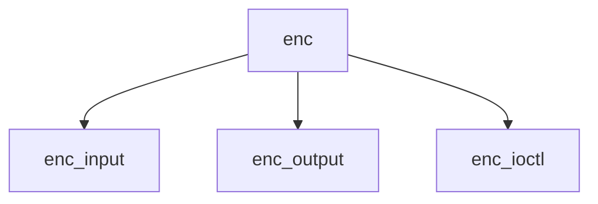

# Component: if_enc.c

**Path:** `sys/net/if_enc.c`
**Type:** File
**Maps to:** `.discovery/sys/net/if_enc.md`

## Purpose

Encapsulated interface - tunnel interface for encapsulated protocols.

## Structure

## Key Functions

| Function | Purpose | Signature |
|----------|---------|-----------|
| `enc_input` | Input | `void enc_input(struct mbuf *m, struct ifnet *ifp)` |
| `enc_output` | Output | `int enc_output(struct ifnet *ifp, struct mbuf *m)` |
| `enc_ioctl` | Ioctl | `int enc_ioctl(struct ifnet *ifp, u_long cmd, caddr_t data)` |

## Use Cases

| Use | Description |
|-----|-------------|
| `encap` | Encapsulation |
| `tunnel` | Tunnel interface |

## Includes

- `net/if_enc.h` - Enc definitions