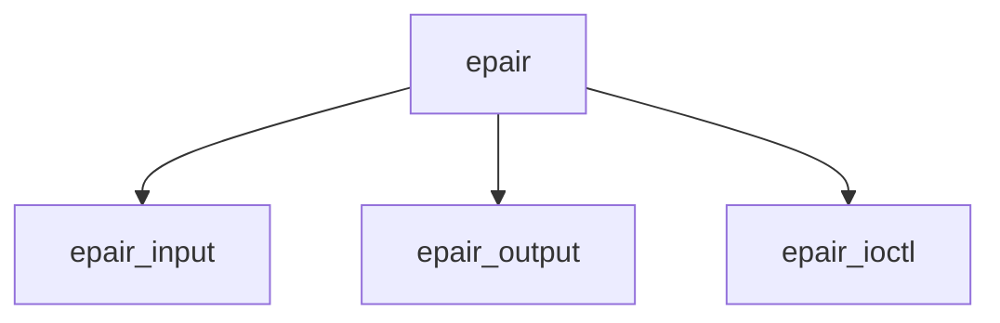

# Component: if_epair.c

**Path:** `sys/net/if_epair.c`
**Type:** File
**Maps to:** `.discovery/sys/net/if_epair.md`

## Purpose

Epair - virtual Ethernet pair (back-to-back connected interfaces).

## Structure

## Key Functions

| Function | Purpose | Signature |
|----------|---------|-----------|
| `epair_input` | Input | `void epair_input(struct mbuf *m, struct ifnet *ifp)` |
| `epair_output` | Output | `int epair_output(struct ifnet *ifp, struct mbuf *m)` |
| `epair_ioctl` | Ioctl | `int epair_ioctl(struct ifnet *ifp, u_long cmd, caddr_t data)` |

## Use Cases

| Use | Description |
|-----|-------------|
| `vnet` | Virtual network |
| `pair` | Interface pair |

## Includes

- `net/if_epair.h` - Epair definitions