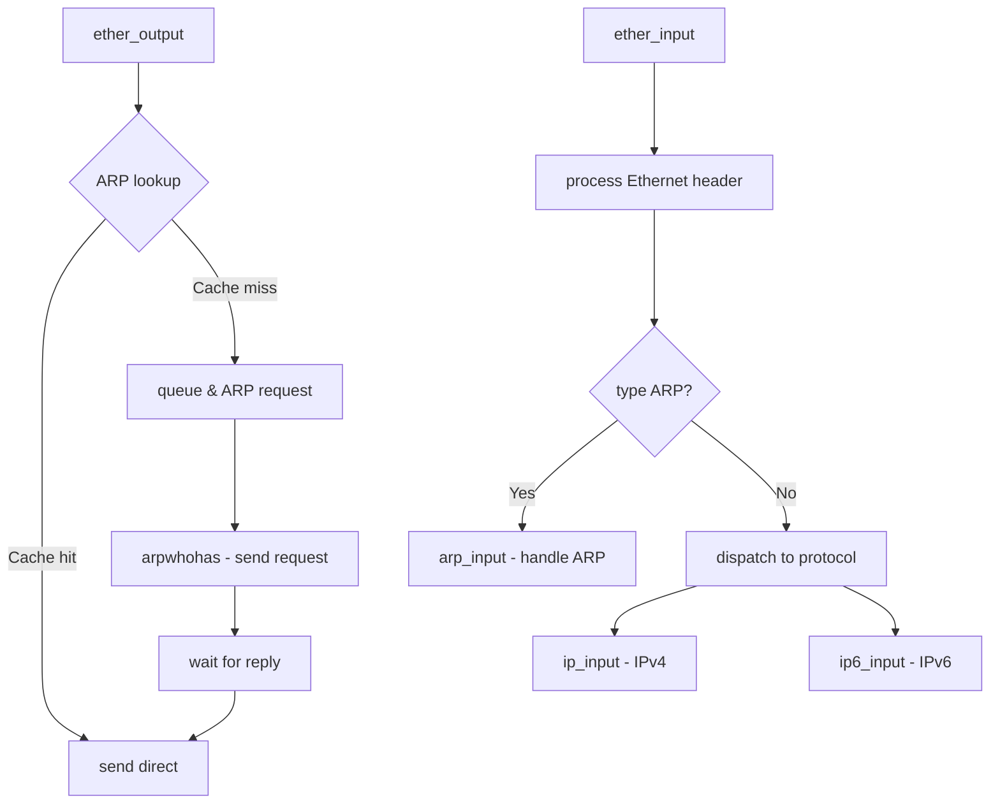

# Component: if_ethersubr.c

**Path:** `sys/net/if_ethersubr.c`
**Type:** File
**Maps to:** `.discovery/sys/net/if_ethersubr.md`

## Purpose

Ethernet substrate - handles Ethernet frame transmission and reception. Implements ARP (Address Resolution Protocol), Ethernet output processing, and Ethernet-specific interface operations.

## Structure

## Key Functions

| Function | Purpose | Signature |
|----------|---------|-----------|
| `ether_output` | Ethernet output | `int ether_output(struct ifnet *ifp, struct mbuf *m, ...)` |
| `ether_input` | Ethernet input | `void ether_input(struct ifnet *ifp, struct mbuf *m)` |
| `arp_whohas` | Send ARP request | `void arp_whohas(struct ifnet *ifp, ...)` |
| `arp_input` | Process ARP packet | `void arp_input(struct ifnet *ifp, struct mbuf *m)` |
| `arpintr` | ARP interrupt handler | `void arpintr(void)` |
| `arp_ifinit` | Initialize ARP for interface | `void arp_ifinit(struct ifnet *ifp, struct ifaddr *ifa)` |
| `ether_ioctl` | Ethernet ioctl | `int ether_ioctl(struct ifnet *ifp, u_long cmd, caddr_t data)` |
| `ether_resolve_multi` | Resolve multicast | `int ether_resolve_multi(...)` |

## Ether Type Values

| Type | Value | Description |
|------|-------|-------------|
| `ETHERTYPE_IP` | 0x0800 | IPv4 |
| `ETHERTYPE_IPV6` | 0x86DD | IPv6 |
| `ETHERTYPE_ARP` | 0x0806 | ARP |
| `ETHERTYPE_REVARP` | 0x8035 | RARP |
| `ETHERTYPE_VLAN` | 0x8100 | VLAN |
| `ETHERTYPE_LOOPBACK` | 0x9000 | Loopback |

## ARP Cache

| Entry State | Description |
|-------------|-------------|
| `ATF_INCOMPLETE` | ARP in progress |
| `ATF_COM` | Complete entry |
| `ATF_PERM` | Permanent entry |
| `ATF_PUBL` | Published entry |

## Includes

- `net/ethernet.h` - Ethernet definitions
- `net/if_arp.h` - ARP definitions
- `netinet/in.h` - Internet addresses

## Depends On

- `net/if.c` for interface management
- `netinet/if_ether.c` for ARP protocol