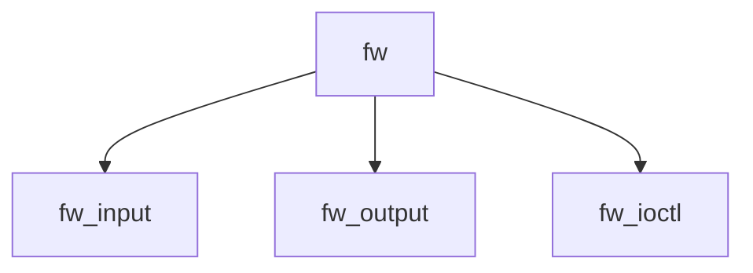

# Component: if_fwsubr.c

**Path:** `sys/net/if_fwsubr.c`
**Type:** File
**Maps to:** `.discovery/sys/net/if_fwsubr.md`

## Purpose

FireWire networking - network interface over FireWire (IEEE 1394).

## Structure

## Key Functions

| Function | Purpose | Signature |
|----------|---------|-----------|
| `fw_input` | Input | `void fw_input(struct ifnet *ifp, struct mbuf *m)` |
| `fw_output` | Output | `int fw_output(struct ifnet *ifp, struct mbuf *m)` |
| `fw_ioctl` | Ioctl | `int fw_ioctl(struct ifnet *ifp, u_long cmd, caddr_t data)` |

## Use Cases

| Use | Description |
|-----|-------------|
| `firewire` | IEEE 1394 networking |
| `ip` | IP over FireWire |

## Includes

- `net/firewire.h` - FireWire definitions