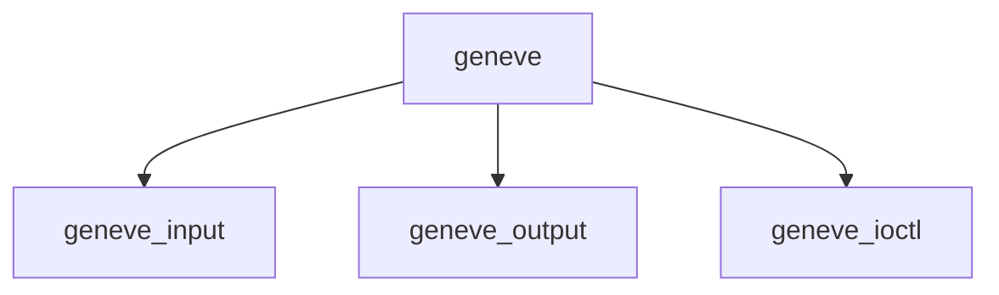

# Component: if_geneve.c

**Path:** `sys/net/if_geneve.c`
**Type:** File
**Maps to:** `.discovery/sys/net/if_geneve.md`

## Purpose

GENEVE tunnel - Generic Network Virtualization Encapsulation tunnel interface.

## Structure

## Key Functions

| Function | Purpose | Signature |
|----------|---------|-----------|
| `geneve_input` | Input | `void geneve_input(struct ifnet *ifp, struct mbuf *m)` |
| `geneve_output` | Output | `int geneve_output(struct ifnet *ifp, struct mbuf *m)` |
| `geneve_ioctl` | Ioctl | `int geneve_ioctl(struct ifnet *ifp, u_long cmd, caddr_t data)` |

## Use Cases

| Use | Description |
|-----|-------------|
| `geneve` | Network virtualization |
| `tunnel` | Tunnel interface |
| `vxlan` | VXLAN alternative |

## Includes

- `net/if_geneve.h` - GENEVE definitions