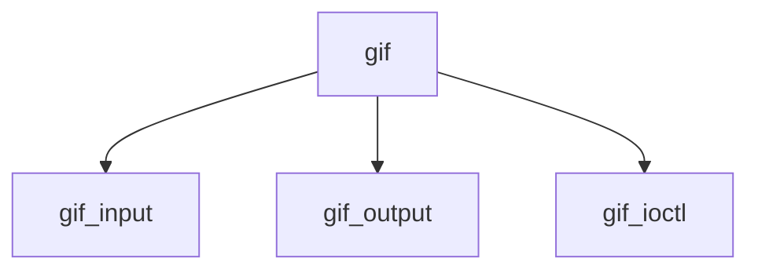

# Component: if_gif.c

**Path:** `sys/net/if_gif.c`
**Type:** File
**Maps to:** `.discovery/sys/net/if_gif.md`

## Purpose

Generic GIF tunnel - tunnel interface for encapsulation.

## Structure

## Key Functions

| Function | Purpose | Signature |
|----------|---------|-----------|
| `gif_input` | Input | `void gif_input(struct mbuf *m, struct ifnet *ifp)` |
| `gif_output` | Output | `int gif_output(struct ifnet *ifp, struct mbuf *m, const struct sockaddr *dst, const struct route *ro)` |
| `gif_ioctl` | Ioctl | `int gif_ioctl(struct ifnet *ifp, u_long cmd, caddr_t data)` |

## Use Cases

| Use | Description |
|-----|-------------|
| `tunnel` | Tunnel interface |
| `gif` | Generic encapsulation |

## Includes

- `net/if_gif.h` - GIF definitions