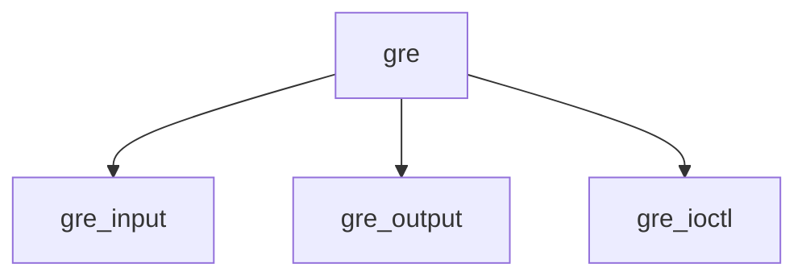

# Component: if_gre.c

**Path:** `sys/net/if_gre.c`
**Type:** File
**Maps to:** `.discovery/sys/net/if_gre.md`

## Purpose

GRE tunnel - Generic Routing Encapsulation tunnel.

## Structure

## Key Functions

| Function | Purpose | Signature |
|----------|---------|-----------|
| `gre_input` | Input | `void gre_input(struct mbuf *m, struct ifnet *ifp)` |
| `gre_output` | Output | `int gre_output(struct ifnet *ifp, struct mbuf *m, const struct sockaddr *dst, const struct route *ro)` |
| `gre_ioctl` | Ioctl | `int gre_ioctl(struct ifnet *ifp, u_long cmd, caddr_t data)` |

## GRE Protocol

| Type | Description |
|------|-------------|
| `GRE_PROTO` | GRE ethertype |

## Use Cases

| Use | Description |
|-----|-------------|
| `tunnel` | GRE tunnel |
| `pptp` | PPTP |

## Includes

- `net/if_gre.h` - GRE definitions