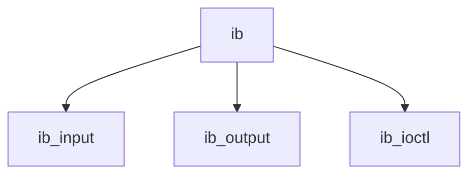

# Component: if_infiniband.c

**Path:** `sys/net/if_infiniband.c`
**Type:** File
**Maps to:** `.discovery/sys/net/if_infiniband.md`

## Purpose

Infiniband interface - network interface for Infiniband networks.

## Structure

## Key Functions

| Function | Purpose | Signature |
|----------|---------|-----------|
| `ib_input` | Input | `void ib_input(struct ifnet *ifp, struct mbuf *m)` |
| `ib_output` | Output | `int ib_output(struct ifnet *ifp, struct mbuf *m)` |
| `ib_ioctl` | Ioctl | `int ib_ioctl(struct ifnet *ifp, u_long cmd, caddr_t data)` |

## Use Cases

| Use | Description |
|-----|-------------|
| `infiniband` | RDMA networking |
| `ib` | InfiniBand |

## Includes

- `net/infiniband.h` - Infiniband definitions