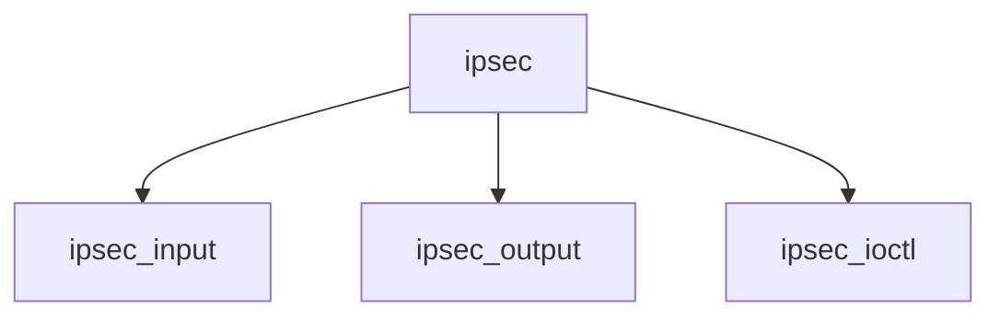

# Component: if_ipsec.c

**Path:** `sys/net/if_ipsec.c`
**Type:** File
**Maps to:** `.discovery/sys/net/if_ipsec.md`

## Purpose

IPsec interface - tunnel interface for IPsec.

## Structure

## Key Functions

| Function | Purpose | Signature |
|----------|---------|-----------|
| `ipsec_input` | Input | `void ipsec_input(struct mbuf *m, struct ifnet *ifp)` |
| `ipsec_output` | Output | `int ipsec_output(struct ifnet *ifp, struct mbuf *m)` |
| `ipsec_ioctl` | Ioctl | `int ipsec_ioctl(struct ifnet *ifp, u_long cmd, caddr_t data)` |

## Use Cases

| Use | Description |
|-----|-------------|
| `ipsec` | IPsec tunnel |
| `crypto` | Encrypted tunnel |

## Includes

- `net/if_ipsec.h` - IPsec definitions