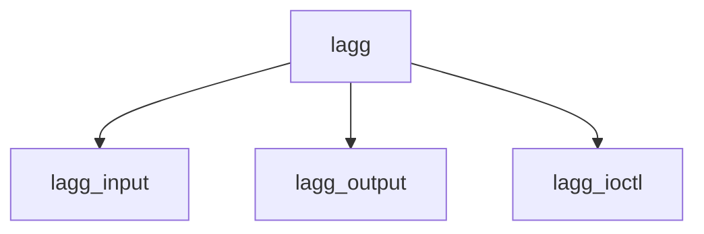

# Component: if_lagg.c

**Path:** `sys/net/if_lagg.c`
**Type:** File
**Maps to:** `.discovery/sys/net/if_lagg.md`

## Purpose

Link aggregation - NIC bonding/teaming interface.

## Structure

## Key Functions

| Function | Purpose | Signature |
|----------|---------|-----------|
| `lagg_input` | Input | `void lagg_input(struct ifnet *ifp, struct mbuf *m)` |
| `lagg_output` | Output | `int lagg_output(struct ifnet *ifp, struct mbuf *m)` |
| `lagg_ioctl` | Ioctl | `int lagg_ioctl(struct ifnet *ifp, u_long cmd, caddr_t data)` |

## Lagg Protocols

| Protocol | Description |
|----------|-------------|
| `LAGG_PROTO_FAILOVER` | Failover |
| `LAGG_PROTO_ROUNDROBIN` | Round robin |
| `LAGG_PROTO_LACP` | LACP |

## Use Cases

| Use | Description |
|-----|-------------|
| `bonding` | NIC bonding |
| `teaming` | Link teaming |

## Includes

- `net/if_lagg.h` - LAGG definitions