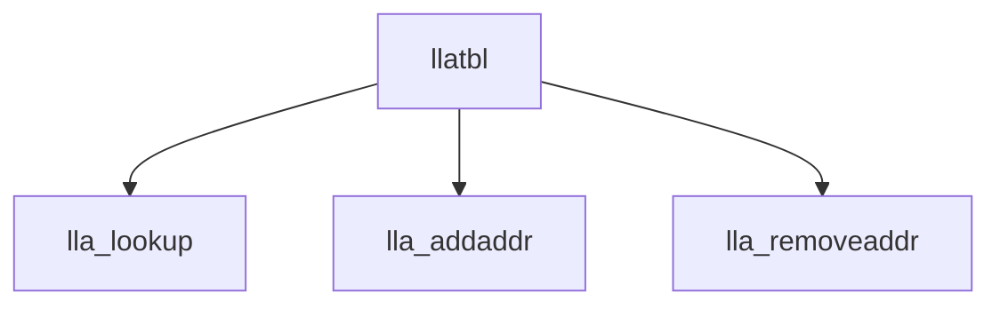

# Component: if_llatbl.c

**Path:** `sys/net/if_llatbl.c`
**Type:** File
**Maps to:** `.discovery/sys/net/if_llatbl.md`

## Purpose

Link-level address table - ARP and neighbor management.

## Structure

## Key Functions

| Function | Purpose | Signature |
|----------|---------|-----------|
| `lla_lookup` | Lookup | `struct ifla *lla_lookup(struct ifnet *ifp, int flags, const struct sockaddr *sa)` |
| `lla_addaddr` | Add | `struct ifla *lla_addaddr(struct ifnet *ifp, struct sockaddr *sa, struct sockaddr *lla, int flags)` |
| `lla_removeaddr` | Remove | `int lla_removeaddr(struct ifnet *ifp, struct sockaddr *sa)` |

## Use Cases

| Use | Description |
|-----|-------------|
| `arp` | ARP table |
| `ndp` | NDP table |

## Includes

- `net/if_llatbl.h` - LLA table definitions