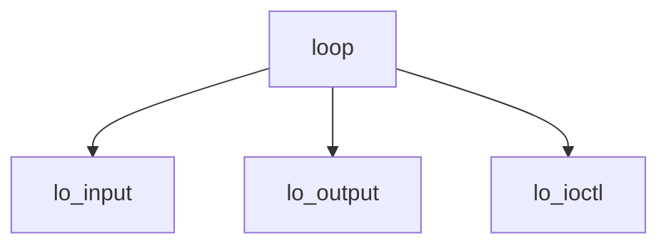

# Component: if_loop.c

**Path:** `sys/net/if_loop.c`
**Type:** File
**Maps to:** `.discovery/sys/net/if_loop.md`

## Purpose

Loopback interface - lo0 interface for protocol testing.

## Structure

## Key Functions

| Function | Purpose | Signature |
|----------|---------|-----------|
| `lo_input` | Input | `void lo_input(struct mbuf *m, struct ifnet *ifp)` |
| `lo_output` | Output | `int lo_output(struct ifnet *ifp, struct mbuf *m, const struct sockaddr *dst, const struct route *ro)` |
| `lo_ioctl` | Ioctl | `int lo_ioctl(struct ifnet *ifp, u_long cmd, caddr_t data)` |

## Use Cases

| Use | Description |
|-----|-------------|
| `loopback` | Loopback interface |
| `testing` | Protocol testing |

## Includes

- `net/if_loop.h` - Loopback definitions