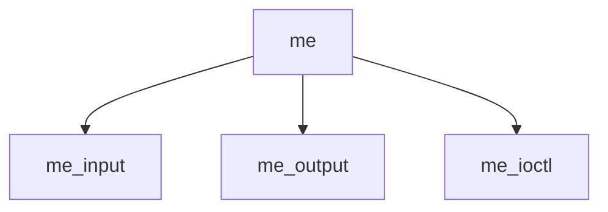

# Component: if_me.c

**Path:** `sys/net/if_me.c`
**Type:** File
**Maps to:** `.discovery/sys/net/if_me.md`

## Purpose

ME interface - Mobile IP encapsulation interface.

## Structure

## Key Functions

| Function | Purpose | Signature |
|----------|---------|-----------|
| `me_input` | Input | `void me_input(struct ifnet *ifp, struct mbuf *m)` |
| `me_output` | Output | `int me_output(struct ifnet *ifp, struct mbuf *m)` |
| `me_ioctl` | Ioctl | `int me_ioctl(struct ifnet *ifp, u_long cmd, caddr_t data)` |

## Use Cases

| Use | Description |
|-----|-------------|
| `mobile-ip` | Mobile IP |
| `encap` | Encapsulation |

## Includes

- `netinet/ip_encap.h` - IP encapsulation