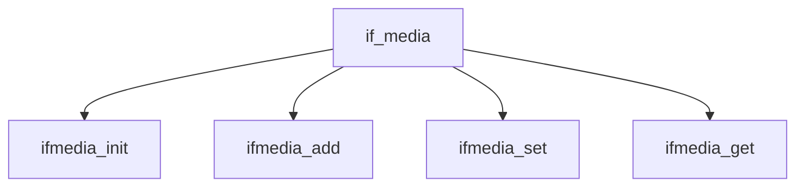

# Component: if_media.c

**Path:** `sys/net/if_media.c`
**Type:** File
**Maps to:** `.discovery/sys/net/if_media.md`

## Purpose

Network media - interface media selection and management.

## Structure

## Key Functions

| Function | Purpose | Signature |
|----------|---------|-----------|
| `ifmedia_init` | Init | `void ifmedia_init(struct ifmedia *media, int ifmw, ifm_change_cb_t change, ifm_stat_cb_t status)` |
| `ifmedia_add` | Add | `int ifmedia_add(struct ifmedia *media, int type, int mask, void *data)` |
| `ifmedia_set` | Set | `int ifmedia_set(struct ifmedia *media, int type)` |
| `ifmedia_get` | Get | `int ifmedia_get(struct ifmedia *media, int *type)` |

## Media Types

| Type | Description |
|------|-------------|
| `IFM_AUTO` | Auto |
| `IFM_ETHER` | Ethernet |
| `IFM_TOKEN` | Token Ring |

## Use Cases

| Use | Description |
|-----|-------------|
| `media` | Media selection |

## Includes

- `net/if_media.h` - Media definitions