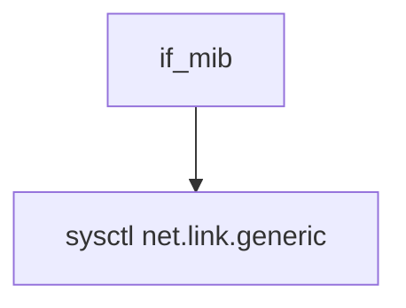

# Component: if_mib.c

**Path:** `sys/net/if_mib.c`
**Type:** File
**Maps to:** `.discovery/sys/net/if_mib.md`

## Purpose

Interface MIB - sysctl MIB for generic interface information.

## Structure

## Sysctl Tree

| Node | Description |
|------|-------------|
| `net.link.generic.system` | System |
| `net.link.generic.ifdata` | Per-interface data |

## Use Cases

| Use | Description |
|-----|-------------|
| `mib` | Interface MIB |
| `sysctl` | Sysctl |

## Includes

- `net/if_mib.h` - MIB definitions