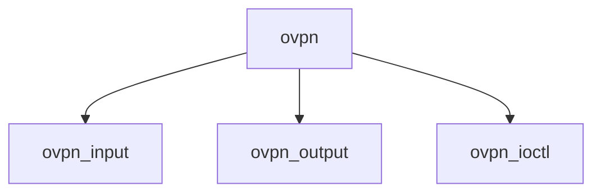

# Component: if_ovpn.c

**Path:** `sys/net/if_ovpn.c`
**Type:** File
**Maps to:** `.discovery/sys/net/if_ovpn.md`

## Purpose

OpenVPN interface - OpenVPN tunnel interface.

## Structure

## Key Functions

| Function | Purpose | Signature |
|----------|---------|-----------|
| `ovpn_input` | Input | `void ovpn_input(struct ifnet *ifp, struct mbuf *m)` |
| `ovpn_output` | Output | `int ovpn_output(struct ifnet *ifp, struct mbuf *m)` |
| `ovpn_ioctl` | Ioctl | `int ovpn_ioctl(struct ifnet *ifp, u_long cmd, caddr_t data)` |

## Use Cases

| Use | Description |
|-----|-------------|
| `openvpn` | OpenVPN tunnel |
| `vpn` | VPN interface |

## Includes

- `net/if_ovpn.h` - OVPN definitions