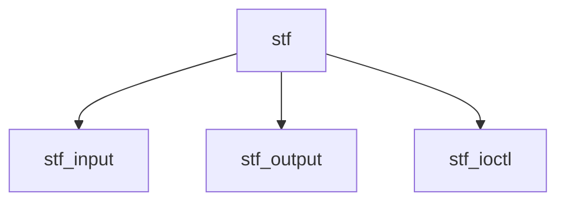

# Component: if_stf.c

**Path:** `sys/net/if_stf.c`
**Type:** File
**Maps to:** `.discovery/sys/net/if_stf.md`

## Purpose

6to4 tunnel - IPv6 tunnel over IPv4 (RFC 3056).

## Structure

## Key Functions

| Function | Purpose | Signature |
|----------|---------|-----------|
| `stf_input` | Input | `void stf_input(struct mbuf *m, struct ifnet *ifp)` |
| `stf_output` | Output | `int stf_output(struct ifnet *ifp, struct mbuf *m, const struct sockaddr *dst, const struct route *ro)` |
| `stf_ioctl` | Ioctl | `int stf_ioctl(struct ifnet *ifp, u_long cmd, caddr_t data)` |

## Use Cases

| Use | Description |
|-----|-------------|
| `6to4` | 6to4 tunnel |
| `tunnel` | IPv6 tunnel |

## Includes

- `net/if_stf.h` - STF definitions