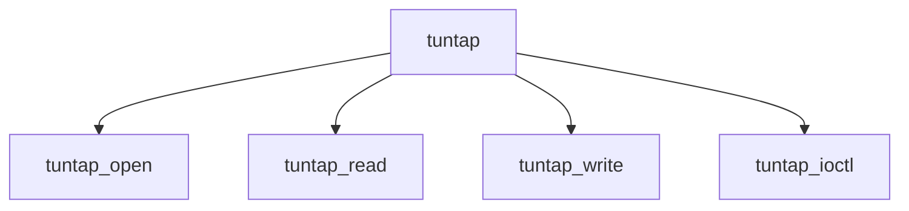

# Component: if_tuntap.c

**Path:** `sys/net/if_tuntap.c`
**Type:** File
**Maps to:** `.discovery/sys/net/if_tuntap.md`

## Purpose

TUN/TAP - tunnel interface for user-space packet I/O.

## Structure

## Key Functions

| Function | Purpose | Signature |
|----------|---------|-----------|
| `tuntap_open` | Open | `int tuntap_open(struct cdev *dev, int mode, int type, struct thread *td)` |
| `tuntap_read` | Read | `int tuntap_read(struct cdev *dev, struct uio *uio, int flags)` |
| `tuntap_write` | Write | `int tuntap_write(struct cdev *dev, struct uio *uio, int flags)` |
| `tuntap_ioctl` | Ioctl | `int tuntap_ioctl(struct cdev *dev, u_long cmd, caddr_t data, int fflag, struct thread *td)` |

## Modes

| Mode | Description |
|------|-------------|
| `TUN` | IP tunnel |
| `TAP` | Ethernet tap |

## Use Cases

| Use | Description |
|-----|-------------|
| `tunnel` | VPN tunneling |
| `vpn` | User-space I/O |

## Includes

- `net/if_tuntap.h` - Tuntap definitions