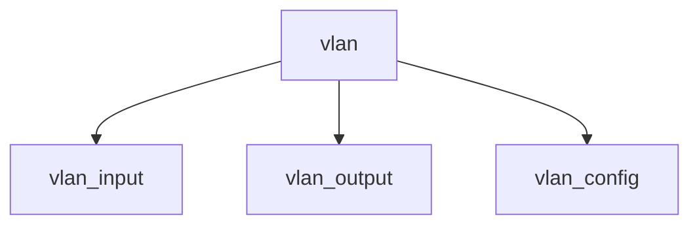

# Component: if_vlan.c

**Path:** `sys/net/if_vlan.c`
**Type:** File
**Maps to:** `.discovery/sys/net/if_vlan.md`

## Purpose

802.1Q VLAN - virtual LAN interface support.

## Structure

## Key Functions

| Function | Purpose | Signature |
|----------|---------|-----------|
| `vlan_input` | Input | `int vlan_input(struct ifnet *ifp, struct mbuf *m)` |
| `vlan_output` | Output | `int vlan_output(struct ifnet *ifp, struct mbuf *m)` |
| `vlan_config` | Config | `int vlan_config(struct ifvlan *ifv, const char *parent)` |

## VLAN Protocol

| Item | Description |
|------|-------------|
| `0x8100` | VLAN ethertype |

## Use Cases

| Use | Description |
|-----|-------------|
| `vlan` | 802.1Q |
| `tagging` | VLAN tagging |

## Includes

- `net/if_vlan.h` - VLAN definitions