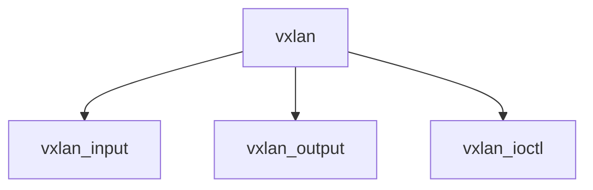

# Component: if_vxlan.c

**Path:** `sys/net/if_vxlan.c`
**Type:** File
**Maps to:** `.discovery/sys/net/if_vxlan.md`

## Purpose

VXLAN tunnel - Virtual eXtensible LAN tunneling.

## Structure

## Key Functions

| Function | Purpose | Signature |
|----------|---------|-----------|
| `vxlan_input` | Input | `void vxlan_input(struct mbuf *m, struct ifnet *ifp)` |
| `vxlan_output` | Output | `int vxlan_output(struct ifnet *ifp, struct mbuf *m, const struct sockaddr *dst, const struct route *ro)` |
| `vxlan_ioctl` | Ioctl | `int vxlan_ioctl(struct ifnet *ifp, u_long cmd, caddr_t data)` |

## VXLAN

| Item | Description |
|------|-------------|
| `VXLAN_PORT` | Default port |
| `VNI` | VXLAN Network ID |

## Use Cases

| Use | Description |
|-----|-------------|
| `vxlan` | VXLAN tunnel |
| `tunnel` | Overlay network |

## Includes

- `net/if_vxlan.h` - VXLAN definitions