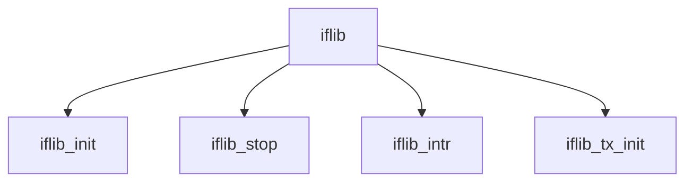

# Component: iflib.c

**Path:** `sys/net/iflib.c`
**Type:** File
**Maps to:** `.discovery/sys/net/iflib.md`

## Purpose

Network interface library - infrastructure for network driver development.

## Structure

## Key Functions

| Function | Purpose | Signature |
|----------|---------|-----------|
| `iflib_init` | Init | `int iflib_init(struct ifnet *ifp)` |
| `iflib_stop` | Stop | `void iflib_stop(struct ifnet *ifp)` |
| `iflib_intr` | Interrupt | `void iflib_intr(void *arg)` |
| `iflib_tx_init` | TX init | `int iflib_tx_init(struct ifnet *ifp)` |

## Use Cases

| Use | Description |
|-----|-------------|
| `driver` | NIC driver |
| `iflib` | Interface library |

## Includes

- `net/iflib.h` - iflib definitions
- `net/if_private.h` - Private interface