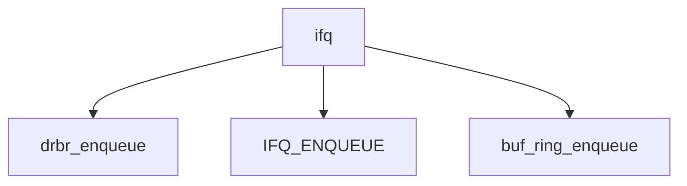

# Component: ifq.c

**Path:** `sys/net/ifq.c`
**Type:** File
**Maps to:** `.discovery/sys/net/ifq.md`

## Purpose

Interface queue - network interface output queue management with ALTQ support.

## Structure

## Key Functions

| Function | Purpose | Signature |
|----------|---------|-----------|
| `drbr_enqueue` | Enqueue | `int drbr_enqueue(struct ifnet *ifp, struct buf_ring *br, struct mbuf *m)` |
| `IFQ_ENQUEUE` | Queue enqueue | `void IFQ_ENQUEUE(struct ifqueue *ifq, struct mbuf *m, int error)` |

## Features

| Feature | Description |
|---------|-------------|
| `ALTQ` | Alternate Queueing |
| `buf_ring` | Buffer ring |
| `ifqueue` | Interface queue |

## Use Cases

| Use | Description |
|-----|-------------|
| `queue` | Queue management |
| `altq` | Traffic shaping |

## Includes

- `net/ifq.h` - Interface queue definitions