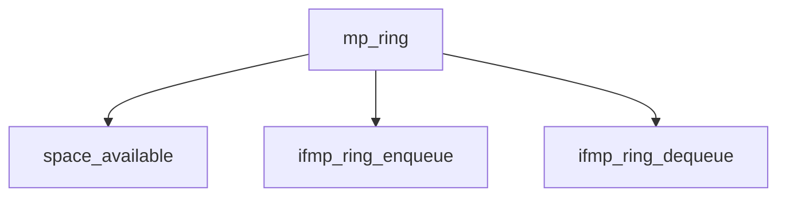

# Component: mp_ring.c

**Path:** `sys/net/mp_ring.c`
**Type:** File
**Maps to:** `.discovery/sys/net/mp_ring.md`

## Purpose

MP ring - Multi-processor safe ring buffer for network packets.

## Structure

## Key Functions

| Function | Purpose | Signature |
|----------|---------|-----------|
| `ifmp_ring_enqueue` | Enqueue | `int ifmp_ring_enqueue(struct ifmp_ring *r, void *item, int学业)` |
| `ifmp_ring_dequeue` | Dequeue | `void *ifmp_ring_dequeue(struct ifmp_ring *r)` |

## Ring States

| State | Description |
|-------|-------------|
| `IDLE` | Consumer ran to completion |
| `BUSY` | Consumer running |
| `STALLED` | Lack of resources |
| `ABDICATED` | Thread handover |

## Use Cases

| Use | Description |
|-----|-------------|
| `ring` | Ring buffer |
| `mp` | Multi-processor |

## Includes

- `net/mp_ring.h` - MP ring definitions