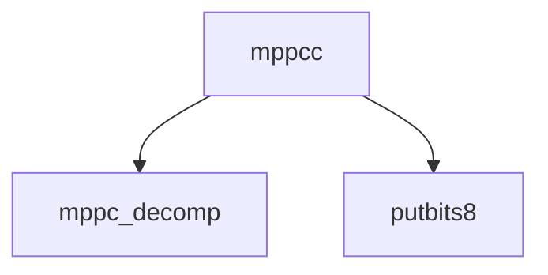

# Component: mppcc.c

**Path:** `sys/net/mppcc.c`
**Type:** File
**Maps to:** `.discovery/sys/net/mppcc.md`

## Purpose

MPPC decompression - Microsoft Point-to-Point Compression decompression library.

## Structure

## Key Functions

| Function | Purpose | Signature |
|----------|---------|-----------|
| `mppc_decomp` | Decompress | `int mppc_decomp(struct mbuf *m, int boff, struct mpppc **state)` |

## MPPC

| Item | Description |
|------|-------------|
| `MPPC` | Microsoft Point-to-Point Compression |
| `HIST_LEN` | History buffer length (8192) |

## Use Cases

| Use | Description |
|-----|-------------|
| `mppc` | Compression |
| `pptp` | PPTP tunneling |

## Includes

- `net/mppc.h` - MPPC definitions