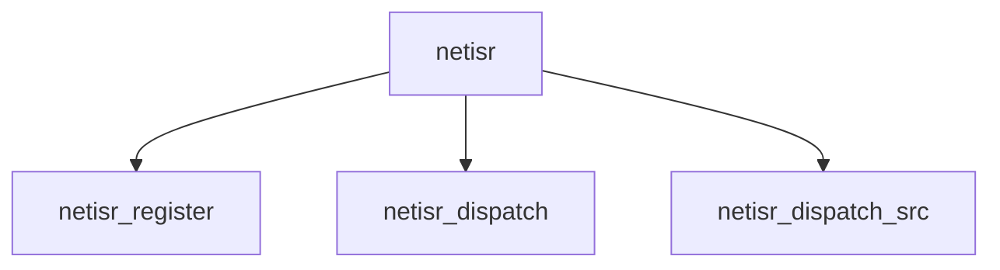

# Component: netisr.c

**Path:** `sys/net/netisr.c`
**Type:** File
**Maps to:** `.discovery/sys/net/netisr.md`

## Purpose

Network ISR - packet dispatch service for protocol handlers.

## Structure

## Key Functions

| Function | Purpose | Signature |
|----------|---------|-----------|
| `netisr_register` | Register | `int netisr_register(const char *name, int proto, netisr_handler_t *handler)` |
| `netisr_dispatch` | Dispatch | `void netisr_dispatch(int proto, struct mbuf *m)` |
| `netisr_dispatch_src` | Dispatch src | `void netisr_dispatch_src(int proto, uint32_t flags, struct mbuf *m)` |

## Policies

| Policy | Description |
|--------|-------------|
| `NETISR_POLICY_SOURCE` | Source |
| `NETISR_POLICY_FLOW` | Flow |
| `NETISR_POLICY_CPU` | CPU |

## Use Cases

| Use | Description |
|-----|-------------|
| `dispatch` | Packet dispatch |
| `protocol` | Protocol handling |

## Includes

- `net/netisr.h` - Netisr definitions