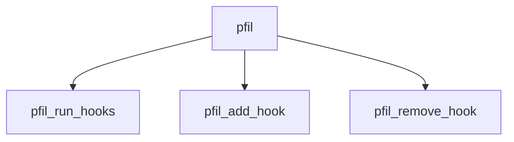

# Component: pfil.c

**Path:** `sys/net/pfil.c`
**Type:** File
**Maps to:** `.discovery/sys/net/pfil.md`

## Purpose

Packet filter hooks - framework for packet filtering at interface level.

## Structure

## Key Functions

| Function | Purpose | Signature |
|----------|---------|-----------|
| `pfil_run_hooks` | Run hooks | `int pfil_run_hooks(struct pfil_head *ph, struct mbuf **m, struct ifnet *ifp, int dir)` |
| `pfil_add_hook` | Add hook | `int pfil_add_hook(struct pfil_hook *hook, struct pfil_head *ph)` |
| `pfil_remove_hook` | Remove hook | `int pfil_remove_hook(struct pfil_hook *hook, struct pfil_head *ph)` |

## Hook Points

| Point | Description |
|-------|-------------|
| `PFIL_IN` | Inbound |
| `PFIL_OUT` | Outbound |

## Use Cases

| Use | Description |
|-----|-------------|
| `firewall` | Firewall hooks |
| `pfil` | Packet filter |

## Includes

- `net/pfil.h` - Pfil definitions