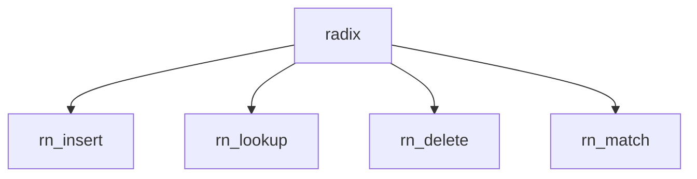

# Component: radix.c

**Path:** `sys/net/radix.c`
**Type:** File
**Maps to:** `.discovery/sys/net/radix.md`

## Purpose

Routing radix tree - radix tree for routing lookups.

## Structure

## Key Functions

| Function | Purpose | Signature |
|----------|---------|-----------|
| `rn_insert` | Insert | `struct radix_node *rn_insert(void *addr, struct radix_head *head, int *error)` |
| `rn_lookup` | Lookup | `struct radix_node *rn_lookup(void *addr, void *mask)` |
| `rn_delete` | Delete | `struct radix_node *rn_delete(void *addr, void *mask, struct radix_node *head)` |
| `rn_match` | Match | `struct radix_node *rn_match(void *addr, struct radix_head *head)` |

## Use Cases

| Use | Description |
|-----|-------------|
| `routing` | Route lookup |
| `radix` | Radix tree |

## Includes

- `net/radix.h` - Radix definitions