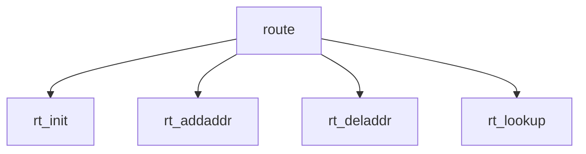

# Component: route.c

**Path:** `sys/net/route.c`
**Type:** File
**Maps to:** `.discovery/sys/net/route.md`

## Purpose

Routing table - routing table management (RIB) and forwarding.

## Structure

## Key Functions

| Function | Purpose | Signature |
|----------|---------|-----------|
| `rt_init` | Init | `void rt_init(void)` |
| `rt_addaddr` | Add route | `int rt_addaddr(struct rtentry **rt, struct sockaddr *sa, struct sockaddr *mask)` |
| `rt_deladdr` | Del route | `int rt_deladdr(struct radix_head *head, struct sockaddr *sa, struct sockaddr *mask)` |
| `rt_lookup` | Lookup | `struct rtentry *rt_lookup(struct sockaddr *dst, struct sockaddr *mask, u_int fibnum)` |

## FIB (Forwarding Information Base)

| Item | Description |
|------|-------------|
| `fib` | Forwarding table |
| `rtentry` | Route entry |

## Use Cases

| Use | Description |
|-----|-------------|
| `routing` | Route management |
| `fib` | FIB |

## Includes

- `net/route.h` - Route definitions