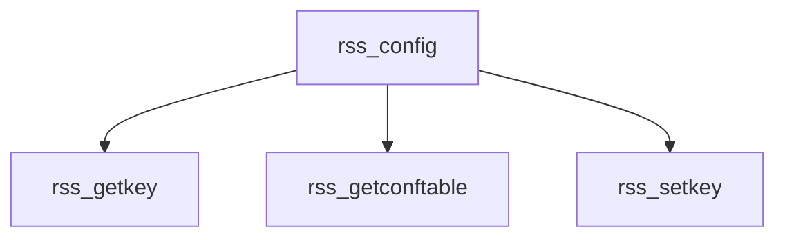

# Component: rss_config.c

**Path:** `sys/net/rss_config.c`
**Type:** File
**Maps to:** `.discovery/sys/net/rss_config.md`

## Purpose

RSS (Receive Side Scaling) configuration - framework for network cards to direct flows to receive queues.

## Structure

## Key Functions

| Function | Purpose | Signature |
|----------|---------|-----------|
| `rss_getkey` | Get key | `void rss_getkey(uint8_t *key)` |
| `rss_getconftable` | Get table | `int rss_getconftable(uint32_t *table, int nitems)` |
| `rss_setkey` | Set key | `int rss_setkey(const uint8_t *key)` |

## RSS Features

| Feature | Description |
|---------|-------------|
| `RSS key` | Hash key |
| `Indirection table` | Queue mapping |
| `Bucket-CPU affinity` | CPU binding |

## Use Cases

| Use | Description |
|-----|-------------|
| `rss` | Receive Side Scaling |
| `multiqueue` | Multi-queue NIC |

## Includes

- `net/rss_config.h` - RSS config definitions
- `net/toeplitz.h` - Toeplitz hash