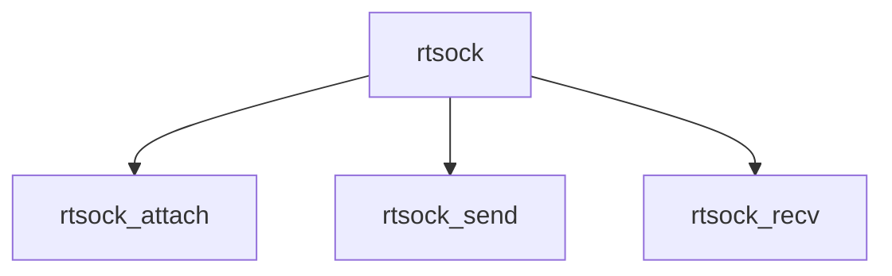

# Component: rtsock.c

**Path:** `sys/net/rtsock.c`
**Type:** File
**Maps to:** `.discovery/sys/net/rtsock.md`

## Purpose

Route socket - PF_ROUTE socket for routing messages.

## Structure

## Key Functions

| Function | Purpose | Signature |
|----------|---------|-----------|
| `rtsock_attach` | Attach | `int rtsock_attach(struct socket *so)` |
| `rtsock_send` | Send | `int rtsock_send(struct socket *so, struct mbuf *m)` |
| `rtsock_recv` | Recv | `int rtsock_recv(struct socket *so, struct mbuf *m)` |

## Use Cases

| Use | Description |
|-----|-------------|
| `routing` | Route socket |
| `netlink` | PF_ROUTE |

## Includes

- `net/route.h` - Route definitions