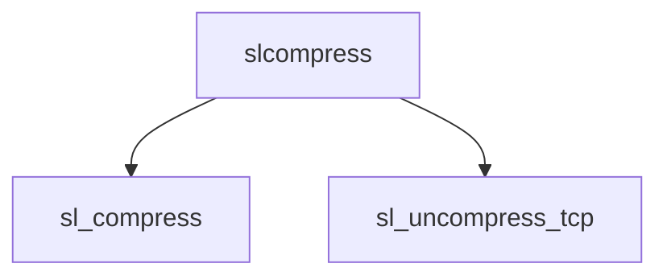

# Component: slcompress.c

**Path:** `sys/net/slcompress.c`
**Type:** File
**Maps to:** `.discovery/sys/net/slcompress.md`

## Purpose

Van Jacobson TCP compression - compress/uncompress TCP packets for serial lines.

## Structure

## Key Functions

| Function | Purpose | Signature |
|----------|---------|-----------|
| `sl_compress` | Compress | `u_int sl_compress(struct slcompress *comp, struct mbuf *m)` |
| `sl_uncompress_tcp` | Uncompress | `int sl_uncompress_tcp(struct mbuf **m, int len, int type, struct slcompress *comp)` |

## Use Cases

| Use | Description |
|-----|-------------|
| `compression` | TCP compression |
| `slip` | SLIP protocol |

## Includes

- `net/slcompress.h` - SLcompress definitions