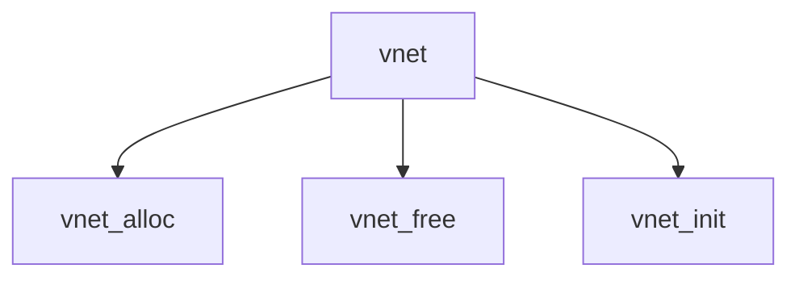

# Component: vnet.c

**Path:** `sys/net/vnet.c`
**Type:** File
**Maps to:** `.discovery/sys/net/vnet.md`

## Purpose

Virtual network stack - network stack virtualization.

## Structure

## Key Functions

| Function | Purpose | Signature |
|----------|---------|-----------|
| `vnet_alloc` | Allocate | `struct vnet *vnet_alloc(void)` |
| `vnet_free` | Free | `void vnet_free(struct vnet *vnet)` |
| `vnet_init` | Initialize | `int vnet_init(void)` |

## VNET

| Item | Description |
|------|-------------|
| `VNET` | Virtual network |
| `CURVNET` | Current vnet |

## Use Cases

| Use | Description |
|-----|-------------|
| `vnet` | Virtual network |
| `jail` | Jail networking |

## Includes

- `net/vnet.h` - VNET definitions