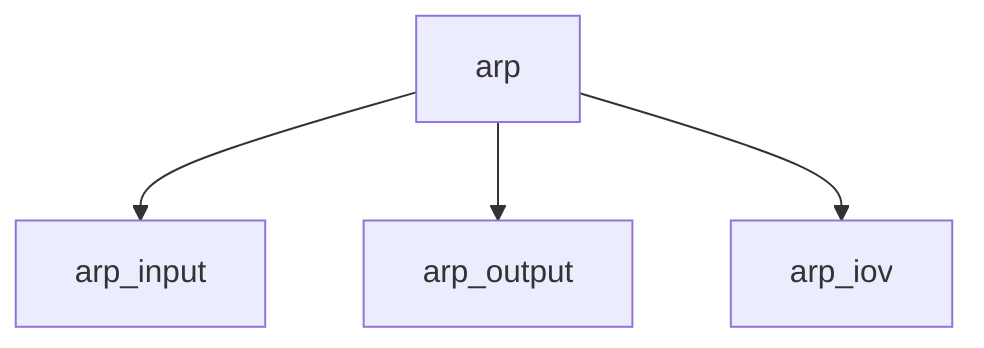

# Component: if_ether.c

**Path:** `sys/netinet/if_ether.c`
**Type:** File
**Maps to:** `.discovery/sys/netinet/if_ether.md`

## Purpose

Ethernet ARP - Address Resolution Protocol for Ethernet.

## Structure

## Key Functions

| Function | Purpose | Signature |
|----------|---------|-----------|
| `arp_input` | Input | `void arp_input(struct ifnet *ifp, struct mbuf *m)` |
| `arp_output` | Output | `int arp_output(struct ifnet *ifp, ...)` |

## Use Cases

| Use | Description |
|-----|-------------|
| `arp` | Address Resolution |
| `ethernet` | Ethernet |

## Includes

- `netinet/if_ether.h` - ARP definitions