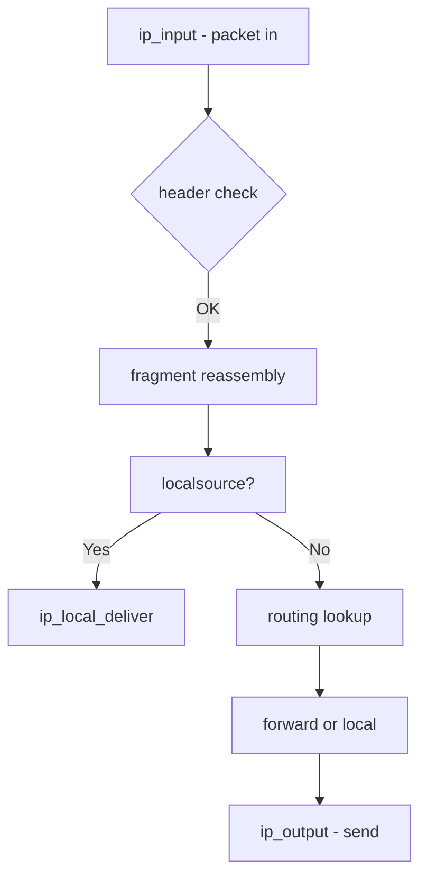

# Component: in.c

**Path:** `sys/netinet/in.c`
**Type:** File
**Maps to:** `.discovery/sys/netinet/in.md`

## Purpose

IPv4 Internet Protocol implementation - core IP layer for IPv4. Handles IP packet input/output, fragmentation, addressing, and raw socket access.

## Structure

## Key Functions

| Function | Purpose | Signature |
|----------|---------|-----------|
| `ip_input` | IPv4 input | `void ip_input(struct mbuf *m)` |
| `ip_output` | IPv4 output | `int ip_output(struct mbuf *m, ...)` |
| `ip_fragment` | Fragment packet | `int ip_fragment(struct mbuf *m, ...)` |
| `ip_reass` | Reassemble | `struct mbuf *ip_reass(struct mbuf *m)` |
| `ip_forward` | Forward packet | `void ip_forward(struct mbuf *m, int srcroute)` |
| `ip_ctloutput` | Socket options | `int ip_ctloutput(struct socket *so, ...)` |
| `ip_setsockopt` | Set IP option | `int ip_setsockopt(struct socket *so, ...)` |
| `ip_getsockopt` | Get IP option | `int ip_getsockopt(struct socket *so, ...)` |

## IP Protocol Numbers

| Proto | Name | Description |
|-------|------|-------------|
| 1 | ICMP | Internet Control Message |
| 6 | TCP | Transmission Control |
| 17 | UDP | User Datagram |
| 132 | SCTP | Stream Control Transmission |

## IP Options

| Option | Description |
|--------|-------------|
| `IP_OPTIONS` | Set IP options |
| `IP_PKTINFO` | Packet info |
| `IP_TTL` | Time to live |
| `IP_DONTFRAG` | Don't fragment |
| `IP_MTU_DISCOVER` | Path MTU discovery |

## Includes

- `netinet/in.h` - IP definitions
- `netinet/in_var.h` - IP variables
- `netinet/ip_var.h` - IP variables

## Depends On

- `net/if.c` for interface I/O
- `netinet/ip_input.c` for input processing