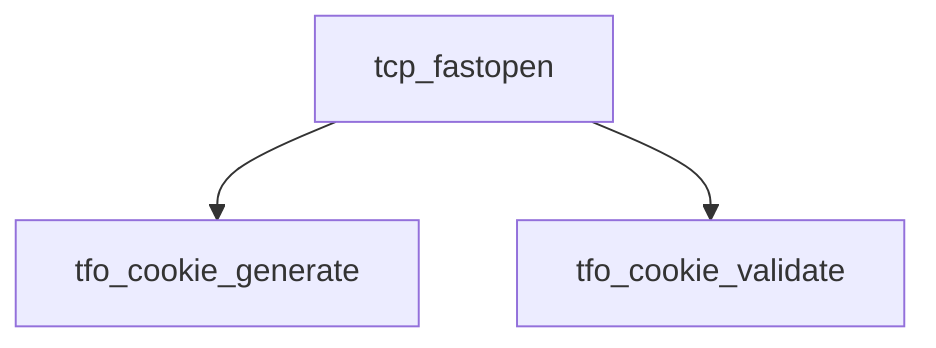

# Component: tcp_fastopen.c

**Path:** `sys/netinet/tcp_fastopen.c`
**Type:** File
**Maps to:** `.discovery/sys/netinet/tcp_fastopen.md`

## Purpose

TCP Fast Open - RFC 7413 implementation for TFO cookies.

## Structure

## Key Functions

| Function | Purpose | Signature |
|----------|---------|-----------|
| `tfo_cookie_generate` | Generate | `int tfo_cookie_generate(struct inpcb *inp, ...)` |
| `tfo_cookie_validate` | Validate | `int tfo_cookie_validate(struct inpcb *inp, ...)` |

## Use Cases

| Use | Description |
|-----|-------------|
| `tcp` | TCP protocol |
| `fastopen` | TCP Fast Open |

## Includes

- `netinet/tcp_fastopen.h` - Fast Open definitions