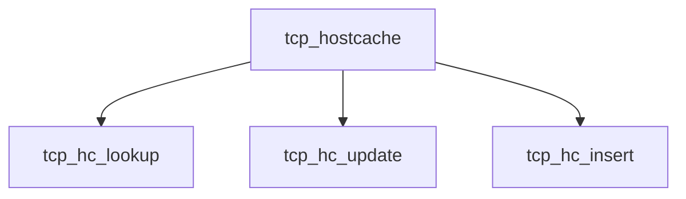

# Component: tcp_hostcache.c

**Path:** `sys/netinet/tcp_hostcache.c`
**Type:** File
**Maps to:** `.discovery/sys/netinet/tcp_hostcache.md`

## Purpose

TCP host cache - cached TCP metrics per remote host.

## Structure

## Key Functions

| Function | Purpose | Signature |
|----------|---------|-----------|
| `tcp_hc_lookup` | Lookup | `int tcp_hc_lookup(struct in_conninfo *inc, ...)` |
| `tcp_hc_update` | Update | `void tcp_hc_update(struct in_conninfo *inc, ...)` |
| `tcp_hc_insert` | Insert | `int tcp_hc_insert(struct in_conninfo *inc, ...)` |

## Use Cases

| Use | Description |
|-----|-------------|
| `tcp` | TCP protocol |
| `hostcache` | Host caching |

## Includes

- `netinet/tcp_hostcache.h` - Host cache definitions