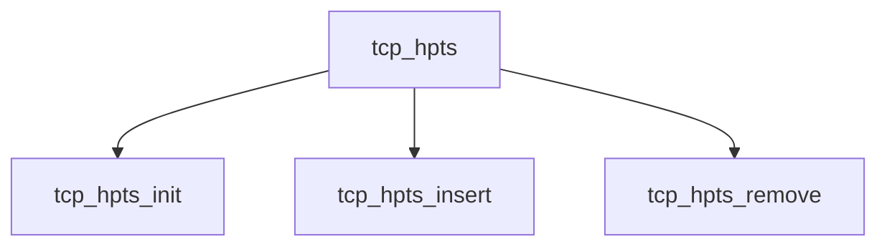

# Component: tcp_hpts.c

**Path:** `sys/netinet/tcp_hpts.c`
**Type:** File
**Maps to:** `.discovery/sys/netinet/tcp_hpts.md`

## Purpose

TCP HPTS - High Priority Transit for packet pacing.

## Structure

## Key Functions

| Function | Purpose | Signature |
|----------|---------|-----------|
| `tcp_hpts_init` | Init | `void tcp_hpts_init(void)` |
| `tcp_hpts_insert` | Insert | `void tcp_hpts_insert(struct tcpcb *tp, int usecs)` |
| `tcp_hpts_remove` | Remove | `void tcp_hpts_remove(struct tcpcb *tp)` |

## Use Cases

| Use | Description |
|-----|-------------|
| `tcp` | TCP protocol |
| `hpts` | High Priority Transit |
| `pacing` | Packet pacing |

## Includes

- `netinet/tcp_hpts.h` - HPTS definitions