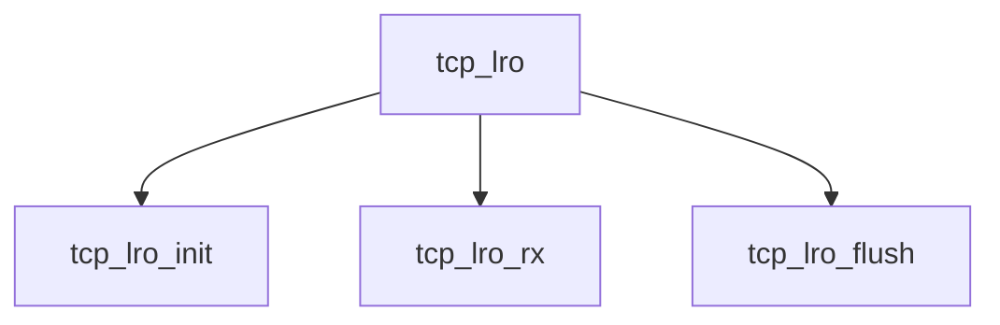

# Component: tcp_lro.c

**Path:** `sys/netinet/tcp_lro.c`
**Type:** File
**Maps to:** `.discovery/sys/netinet/tcp_lro.md`

## Purpose

TCP LRO - Large Receive Offload for TCP.

## Structure

## Key Functions

| Function | Purpose | Signature |
|----------|---------|-----------|
| `tcp_lro_init` | Init | `int tcp_lro_init(struct lro_ctrl *lc)` |
| `tcp_lro_rx` | Receive | `int tcp_lro_rx(struct lro_ctrl *lc, struct mbuf *m, ...)` |
| `tcp_lro_flush` | Flush | `int tcp_lro_flush(struct lro_ctrl *lc, struct lro_entry *le)` |

## Use Cases

| Use | Description |
|-----|-------------|
| `tcp` | TCP protocol |
| `lro` | Large Receive Offload |

## Includes

- `netinet/tcp_lro.h` - LRO definitions