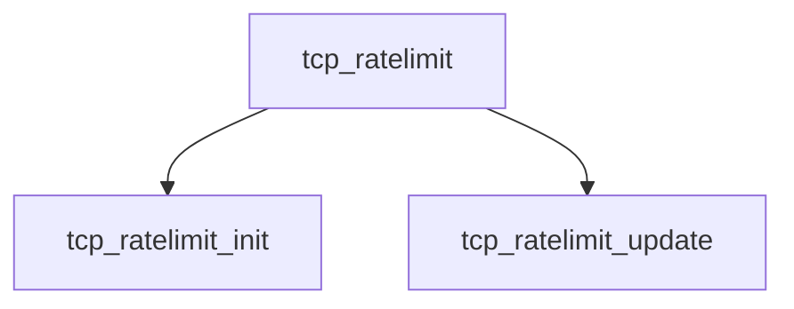

# Component: tcp_ratelimit.c

**Path:** `sys/netinet/tcp_ratelimit.c`
**Type:** File
**Maps to:** `.discovery/sys/netinet/tcp_ratelimit.md`

## Purpose

TCP rate limiting - TCP rate limiting for bandwidth management.

## Structure

## Key Functions

| Function | Purpose | Signature |
|----------|---------|-----------|
| `tcp_ratelimit_init` | Init | `int tcp_ratelimit_init(void)` |
| `tcp_ratelimit_update` | Update | `void tcp_ratelimit_update(struct tcpcb *tp, ...)` |

## Use Cases

| Use | Description |
|-----|-------------|
| `tcp` | TCP protocol |
| `ratelimit` | Rate limiting |

## Includes

- `netinet/tcp_ratelimit.h` - TCP ratelimit definitions