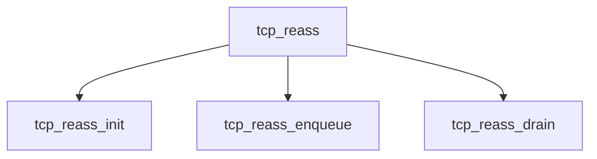

# Component: tcp_reass.c

**Path:** `sys/netinet/tcp_reass.c`
**Type:** File
**Maps to:** `.discovery/sys/netinet/tcp_reass.md`

## Purpose

TCP reassembly - TCP segment reassembly queue.

## Structure

## Key Functions

| Function | Purpose | Signature |
|----------|---------|-----------|
| `tcp_reass_init` | Init | `void tcp_reass_init(void)` |
| `tcp_reass_enqueue` | Enqueue | `int tcp_reass_enqueue(struct tcpcb *tp, ...)` |
| `tcp_reass_drain` | Drain | `void tcp_reass_drain(struct tcpcb *tp)` |

## Use Cases

| Use | Description |
|-----|-------------|
| `tcp` | TCP protocol |
| `reassembly` | Segment reassembly |

## Includes

- `netinet/tcp_var.h` - TCP variables