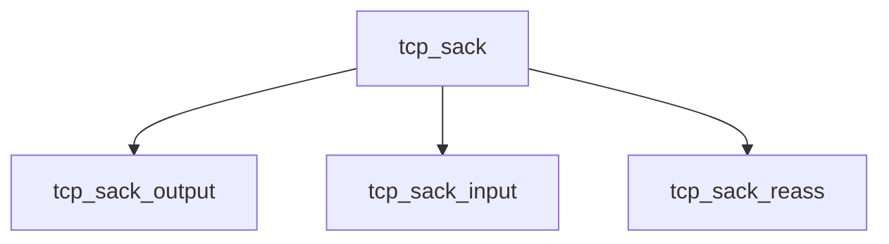

# Component: tcp_sack.c

**Path:** `sys/netinet/tcp_sack.c`
**Type:** File
**Maps to:** `.discovery/sys/netinet/tcp_sack.md`

## Purpose

TCP SACK - TCP Selective Acknowledgment implementation.

## Structure

## Key Functions

| Function | Purpose | Signature |
|----------|---------|-----------|
| `tcp_sack_output` | Output | `void tcp_sack_output(struct tcpcb *tp, ...)` |
| `tcp_sack_input` | Input | `void tcp_sack_input(struct tcpcb *tp, ...)` |
| `tcp_sack_reass` | Reassemble | `int tcp_sack_reass(struct tcpcb *tp, ...)` |

## Use Cases

| Use | Description |
|-----|-------------|
| `tcp` | TCP protocol |
| `sack` | Selective ACK |

## Includes

- `netinet/tcp_var.h` - TCP variables